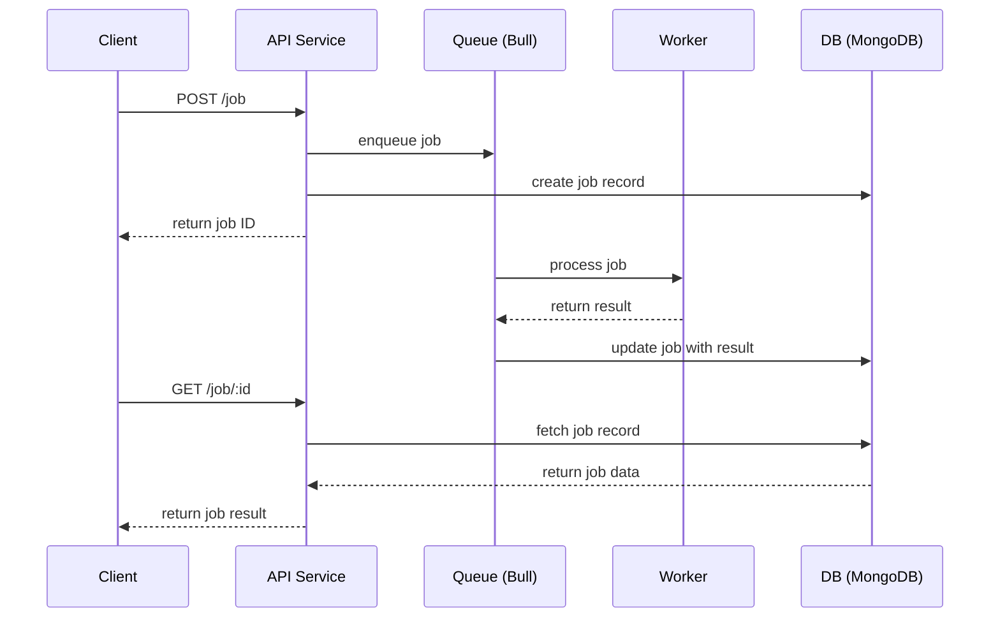

# Queued Web Service

This repo is an example for a web service that uses a queue to process jobs.

Use POST API to create a job, and GET API to get job status / result.

Job will take 5 seconds to complete.

## Table of Contents

- [Quick Start with Docker](#quick-start-with-docker)
- [Run Locally](#run-locally)
- [System Diagram](#system-diagram)

## Quick Start with Docker

### Start Service

```bash
cp .env.example .env
docker compose up -d --build
```

### API Logs

```
docker compose logs -f api
```

When service is running, navigate to [http://localhost:4000/api-docs](http://localhost:4000/api-docs) to view API docs.

## Service Usage

### Create a job

```bash
curl -X POST http://localhost:4000/api/queued-job \
     -H "Content-Type: application/json" \
     -d '{"name":"your name"}'
```

Returns **202**

```json
{ "jobId": "ID" }
```

### Get job status / result

Jobs will take 5 seconds to complete

```bash
curl http://localhost:4000/api/queued-job/<ID>
```

When the job is **queued**, it returns

```json
{ "status": "queued" }
```

When the job is **completed**, it returns

```json
{
  "status": "completed",
  "name": "job name"
}
```

## Stop Service

```
docker compose down -v
```

</br>

# Run Locally

## Prerequisites

| Service     | Version | Default URL                 |
| ----------- | ------- | --------------------------- |
| **Node.js** | ≥ 18.x  |                             |
| **MongoDB** | ≥ 5.x   | `mongodb://localhost:27017` |
| **Redis**   | ≥ 6.x   | `redis://localhost:6379`    |

Start dev containers if needed:

```bash
docker run -d --name mongo -p 27017:27017 mongo:7
docker run -d --name redis -p 6379:6379 redis:7-alpine
```

## Environment Vars

Create **`.env`** (or copy `.env.example`):

```bash
cp .env.example .env
```

---

## Run Service

Make sure MongoDB and Redis are running.

```bash
npm install
node index.mjs
```

Swagger UI: [http://localhost:4000/api-docs](http://localhost:4000/api-docs)

## Run Tests

```bash
npm install
npm test
```

</br>

# System Diagram


